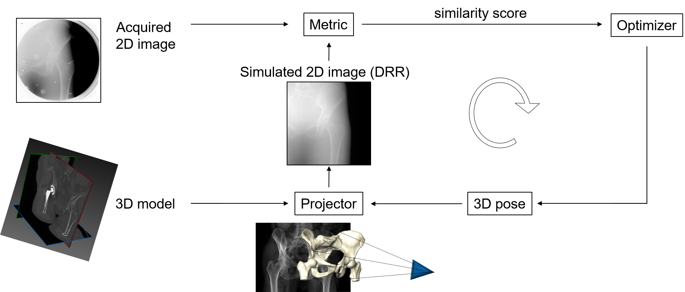

# GPU accelerated 2D/3D registration

# Brief Description
The repository contains a framework for 2D/3D image registration between 2D X-ray images and either a CT/MRI scan or an STL (CAD) model.

Generation of Digitally Reconstructed Radiographs (DRR) for registration of a CT/MRI scan is GPU accelerated.

The framework uses several python libraries (ITK, VTK, Opencv, NLopt) and it includes different main python modules:
- HipHop: the implemented class HipHop puts together the different registration components.
- ProjectorsModule: for generation of Digitally Reconstructed Radiographs (DRR) from either a volumetric image (CT,MRI) or an STL model.
- MetricsModule: includes several different similarity metrics for 2D/2D image registration.
- OptimizersModule: includes different optimization techniques for image registration.
The modules for the projector, the metrics and the optimizer are implemented in a way that a new method can be plugged-in by means of an object factory mechanism.

The CUDA accelerated library for DRR generation from CT/MRI scan is provided already wrapped in Python as "SiddonGpuPy.pyd" file. The original C/C++ codes
and the method for wrapping the library in Python using Cython are available in another repository. 
 
# Installation
Use the code is with an Anaconda environment equipped with python-3.X, Python itk, Python vtk, Python openCV and Cython. Parallelization was achieved with CUDA API on Microsoft Visual Studio Community 2015 in a Windows 10 Enterprise environment and a graphic card NVIDIA Quadro M5000 with 8 GB memory.

Procedure:

    1) Create the Anaconda environment (if not created yet): conda create -n HipHop python=3 anaconda.

    2) Install required Python packages: 

	a. Install itk with (https://discourse.itk.org/t/itkvtkglue-module-in-python-wheel/393):
	pip install itk
	
	b. Install vtk with (https://stackoverflow.com/questions/43184009/install-vtk-with-anaconda-3-6 ): 
	conda install -c clinicalgraphics vtk

	c. Install opencv:
	download the unofficial binary python wheels for python 3.6 from https://www.lfd.uci.edu/~gohlke/pythonlibs/#opencv,
	and install following the instructions from  https://stackoverflow.com/questions/42994813/installing-opencv-on-windows-10-with-python-3-6-and-anaconda-3-6

	d. Install NLopt library for Python
	(https://nlopt.readthedocs.io/en/latest/NLopt_on_Windows/)

    3) Activate the environment: source activate HipHop.

    4) git clone https://github.com/fabio86d/HipHop_2D3Dregistration.git.

# Test the package

In order to run 2D/3D registration between STL model and an X-ray image:
run "python Register_femoral_implant.py ..\\input_data\\HOPE_Test"

In order to run 2D/3D registration between CT scan and an X-ray image:
run "python Register_CT_pelvis.py ..\\input_data\\HipPhantom"